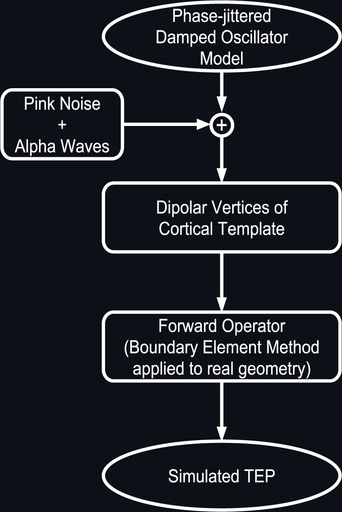
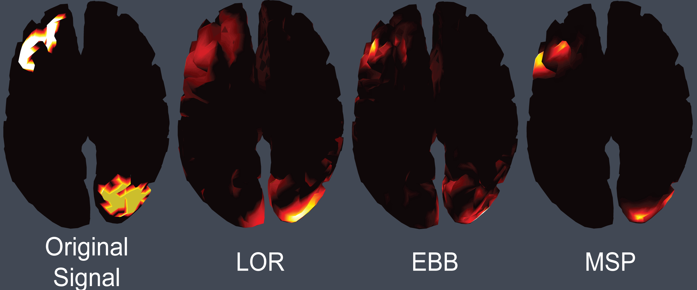

# Comparison of Different Source Estimation Methods for TMS evoked EEG Potentials
### B. A. Couto*, A. G. Casali
Institute of Science and Technology, Federal University of São Paulo, São José dos Campos, Brazil
### Keywords. TMS; hd-EEG; EEG Source Estimation; Inverse Solution; Effective connectivity;

## Background, Motivation and Objective.

The combination of high-density electroencephalography (hd-EEG) and transcranial magnetic stimulation (TMS) is currently being employed to non-invasively assess cortical effective connectivity in humans. In particular, brain complexity measures based on TMS/hd-EEG potentials, such as the Perturbational Complexity Index, have recently attracted considerable attention due to their potential for improving clinical diagnosis of neurological conditions. Such measures of connectivity rely upon source localization techniques to estimate the neural sources of EEG potentials. Recent studies based on spontaneous EEG signals and peripheral evoked potentials have shown contrasting results across different source estimation methods, particularly in situations of low signal to noise ratio. The purpose of this study is to **evaluate the performance of source modeling algorithms** in estimating neural activations from TMS-evoked EEG responses.

## Methods.

Simulated multi-trial TMS-like responses were created using a phase-jittered damped oscillator model with frequencies and latencies of real TMS-evoked potentials and corrupted by additive pink noise and alpha waves at different intensities. The resulting simulated sources were then applied to dipolar vertices located in the frontal and occipital lobes of a cortical template. A forward operator, calculated by applying the Boundary Element Method to real geometry, was used to project the simulated currents onto a high-density EEG-space. Three well-known inverse methods were then employed to estimate sources from the simulated EEG signals: Loreta (LOR), Empirical Bayesian Beamformer (EBB) and Multiple Sparse Priors (MSP). A non-parametric statistics with respect to the baseline (pre-stimulus) was applied to the estimated currents and significant spatiotemporal patterns of TMS-evoked activations were finally extracted for each method. Localization errors produced by each method were tested by calculating the total number of errors, the geodesic distance to the real activated regions and the intensity of misplaced signals for different levels of noise and current distribution.

<b>Figure 1.</b> Simulation of TMS/hd-EEG potentials 

## Results.

There were significant differences between the performances of all three EEG source estimation methods tested in this study. While LOR and EBB tended to spread low intensity currents throughout the cortex, reaching areas that weren’t activated, MSP achieved a better performance in terms of source location. At the same time, when compared with LOR and EBB, the MSP method resulted in misplaced sources having greater current intensities. These observed differences increased with decreasing signal-to-noise ratio and the performances of the three methods converged when simulated sources were less distributed in the cortex.

<b>Figure 2.</b> Results of Source Reconstruction for Different Methods 

## Discussion and Conclusions.

In this work we tested the performance of well-known EEG source localization techniques on simulated TMS-like signals. In accordance with previous results based on peripheral evoked potentials, we found that the **MSP method was able to estimate a better spatial representation of the TMS-evoked responses**, even though **wrong sources in this method tended to show more intense currents than in Loreta and EBB**. Further studies should be conducted to evaluate how the different performances of source estimation methods reported in this work can impact on specific TMS/EEG measures of effective connectivity, such as the Perturbational Complexity Index.

<b>Figure 3.</b> Comparisson of Source Estimation Methods 

#### **Acknowledgment: São Paulo Research Foundation (FAPESP), grant 2016/08263-9**

## References